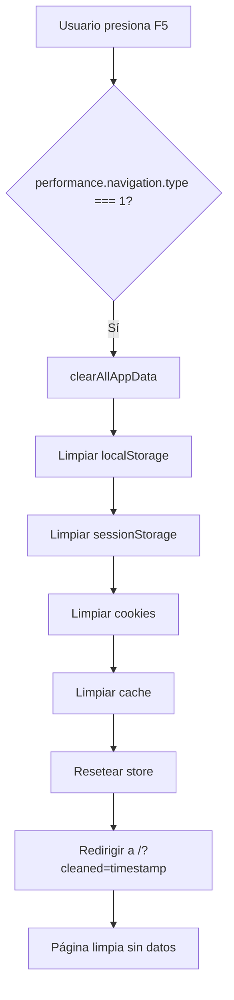

# Sistema de Limpieza Automática de Datos

## 🎯 Objetivo

Implementar un sistema completo de limpieza de datos que:
1. ✅ **Borre todos los datos al recargar la página** (F5, Ctrl+R)
2. ✅ **Limpie cache, localStorage, sessionStorage, cookies**
3. ✅ **El botón "Limpiar" haga limpieza total**
4. ✅ **Prevenga navegación hacia atrás después de limpiar**

---

## 📋 Cambios Implementados

### 1️⃣ **Nueva Función: `clearAllAppData()`** 
**Archivo:** `src/lib/stores/signature.ts`

Esta función realiza una limpieza **COMPLETA** de todos los datos de la aplicación:

```typescript
export function clearAllAppData() {
  if (!browser) return;
  
  try {
    // 1. Limpiar localStorage
    localStorage.clear();
    
    // 2. Limpiar sessionStorage
    sessionStorage.clear();
    
    // 3. Limpiar cookies del dominio
    document.cookie.split(';').forEach(cookie => {
      const eqPos = cookie.indexOf('=');
      const name = eqPos > -1 ? cookie.substr(0, eqPos) : cookie;
      document.cookie = name + '=;expires=Thu, 01 Jan 1970 00:00:00 GMT;path=/';
    });
    
    // 4. Resetear el store a valores iniciales
    signatureData.set(initialSignatureData);
    
    // 5. Limpiar cache del navegador (si está disponible)
    if ('caches' in window) {
      caches.keys().then(names => {
        names.forEach(name => {
          caches.delete(name);
        });
      });
    }
    
    console.log('✅ Todos los datos de la aplicación han sido limpiados');
  } catch (error) {
    console.error('Error al limpiar datos:', error);
  }
}
```

#### 🧹 **Qué Limpia:**
- ✅ **localStorage** - Todos los datos guardados
- ✅ **sessionStorage** - Datos de sesión temporal
- ✅ **Cookies** - Todas las cookies del dominio
- ✅ **Store de Svelte** - Resetea `signatureData` a valores iniciales
- ✅ **Cache del navegador** - Cache Service Worker y Cache API

---

### 2️⃣ **Prevención de Navegación Hacia Atrás**
**Archivo:** `src/lib/stores/signature.ts`

Nueva función que previene que el usuario vuelva atrás después de limpiar:

```typescript
export function preventBackNavigation() {
  if (!browser) return;
  
  // Agregar entrada al historial
  window.history.pushState(null, '', window.location.href);
  
  // Prevenir el botón "atrás"
  window.addEventListener('popstate', function(event) {
    window.history.pushState(null, '', window.location.href);
    showToast('info', '⚠️ No puedes volver atrás después de limpiar los datos');
  });
}
```

#### 🚫 **Comportamiento:**
- Usuario hace click en "Limpiar" → Datos se borran
- Usuario presiona botón "Atrás" del navegador → ❌ **Bloqueado**
- Muestra mensaje: *"⚠️ No puedes volver atrás después de limpiar los datos"*

---

### 3️⃣ **Detección de Recarga de Página**
**Archivo:** `src/routes/+page.svelte`

Detecta cuando el usuario recarga la página (F5, Ctrl+R) y limpia automáticamente:

```typescript
onMount(() => {
  // Verificar si es una recarga de página (F5 o Ctrl+R)
  if (browser && performance.navigation.type === 1) {
    // Es una recarga - limpiar TODOS los datos
    console.log('🔄 Recarga detectada - limpiando todos los datos...');
    clearAllAppData();
    
    // Forzar recarga completa sin cache
    window.location.href = window.location.origin + '/?cleaned=' + Date.now();
    return; // Salir temprano
  }
  
  // ... resto del código
});
```

#### 🔄 **Cómo Funciona:**

| Acción del Usuario | Resultado |
|---------------------|-----------|
| Presiona **F5** | 🧹 Limpia todos los datos + recarga |
| Presiona **Ctrl+R** | 🧹 Limpia todos los datos + recarga |
| Click en botón "Recargar" | 🧹 Limpia todos los datos + recarga |
| Navega normalmente | ✅ Datos se mantienen |

#### 🔍 **Detección Técnica:**
```javascript
performance.navigation.type === 1
```
- `0` = Navegación normal (click en link)
- `1` = **Recarga de página** (F5, Ctrl+R) ✅
- `2` = Navegación desde historial (atrás/adelante)
- `255` = Otro tipo de navegación

---

### 4️⃣ **Botón "Limpiar" Mejorado**
**Archivo:** `src/routes/+layout.svelte`

El botón de limpieza ahora hace una limpieza **TOTAL**:

```javascript
function clearAllData() {
  if (confirm('¿Estás seguro de que quieres limpiar todos los datos? Esta acción limpiará todo: localStorage, cache, cookies y datos guardados. No podrás volver atrás.')) {
    // Limpiar TODOS los datos de la aplicación
    clearAllAppData();
    
    // Prevenir navegación hacia atrás
    preventBackNavigation();
    
    showToast('success', '✅ Todos los datos han sido limpiados completamente');
    
    // Navegar a la raíz y forzar recarga completa
    goto('/').then(() => {
      setTimeout(() => {
        // Forzar recarga completa sin cache
        window.location.href = window.location.origin + '/?nocache=' + Date.now();
      }, 100);
    });
  }
}
```

#### ⚠️ **Diálogo de Confirmación:**
```
¿Estás seguro de que quieres limpiar todos los datos?

Esta acción limpiará todo:
- localStorage
- cache
- cookies
- datos guardados

No podrás volver atrás.

[Cancelar] [OK]
```

---

## 🔄 Flujo Completo de Limpieza

### **Escenario 1: Recarga de Página (F5)**



### **Escenario 2: Botón "Limpiar"**

```mermaid
graph TD
    A[Usuario click en Limpiar] --> B{Confirmar?}
    B -->|No| C[Cancelar]
    B -->|Sí| D[clearAllAppData]
    D --> E[preventBackNavigation]
    E --> F[Mostrar toast]
    F --> G[goto('/')]
    G --> H[window.location.href con ?nocache]
    H --> I[Página limpia]
    I --> J[Botón Atrás bloqueado]
```

---

## 🧪 Casos de Prueba

### ✅ **Test 1: Recarga con F5**

**Pasos:**
1. Llenar datos de firma (nombre, email, etc.)
2. Verificar que datos aparecen en localStorage
3. Presionar **F5**

**Resultado Esperado:**
- ✅ localStorage vacío
- ✅ sessionStorage vacío
- ✅ Cookies borradas
- ✅ Página recarga con datos en blanco
- ✅ Console muestra: `"🔄 Recarga detectada - limpiando todos los datos..."`

---

### ✅ **Test 2: Botón Limpiar**

**Pasos:**
1. Llenar datos de firma
2. Click en botón "🗑️ Limpiar"
3. Click en "OK" en el diálogo

**Resultado Esperado:**
- ✅ Muestra confirmación
- ✅ Limpia todos los datos
- ✅ Muestra toast: `"✅ Todos los datos han sido limpiados completamente"`
- ✅ Redirige a `/` con parámetro `?nocache=`
- ✅ Botón "Atrás" del navegador bloqueado

---

### ✅ **Test 3: Prevención de Navegación Atrás**

**Pasos:**
1. Llenar datos de firma
2. Click en "Limpiar" → Confirmar
3. Intentar presionar botón "Atrás" del navegador

**Resultado Esperado:**
- ❌ No navega hacia atrás
- ✅ Muestra toast: `"⚠️ No puedes volver atrás después de limpiar los datos"`
- ✅ Permanece en página principal vacía

---

### ✅ **Test 4: URLs con Parámetros (No Afectadas)**

**Pasos:**
1. Abrir URL compartida con datos precargados:
   ```
   http://localhost:5173/?name=Juan&email=juan@mail.com
   ```
2. Verificar que los datos se cargan

**Resultado Esperado:**
- ✅ Datos de URL se cargan correctamente
- ✅ NO se limpian automáticamente
- ✅ Solo si usuario presiona F5, se limpian

---

### ✅ **Test 5: URL Limpia vs URL con Parámetros**

**Situación A - URL Limpia:**
```
http://localhost:5173/
```
**Comportamiento:**
- F5 → Limpia datos ✅

**Situación B - URL con `?cleaned=`:**
```
http://localhost:5173/?cleaned=1728288000000
```
**Comportamiento:**
- Detecta que viene de limpieza
- Limpia parámetro de URL
- Muestra estado inicial limpio
- NO vuelve a limpiar (evita loop infinito)

**Situación C - URL con datos compartidos:**
```
http://localhost:5173/?name=Juan&email=juan@mail.com
```
**Comportamiento:**
- Carga datos desde URL
- NO limpia automáticamente
- Usuario puede usar datos precargados

---

## 🔧 Detalles Técnicos

### **1. Limpieza de localStorage**

```javascript
localStorage.clear();
```

**Borra:**
- `signatureData` - Datos de la firma
- Cualquier otra clave guardada

---

### **2. Limpieza de sessionStorage**

```javascript
sessionStorage.clear();
```

**Borra:**
- Datos temporales de sesión
- No afecta a otras pestañas

---

### **3. Limpieza de Cookies**

```javascript
document.cookie.split(';').forEach(cookie => {
  const eqPos = cookie.indexOf('=');
  const name = eqPos > -1 ? cookie.substr(0, eqPos) : cookie;
  document.cookie = name + '=;expires=Thu, 01 Jan 1970 00:00:00 GMT;path=/';
});
```

**Cómo Funciona:**
1. Lee todas las cookies del dominio
2. Extrae el nombre de cada cookie
3. Establece fecha de expiración en el pasado (1970)
4. Cookie se elimina automáticamente

---

### **4. Limpieza de Cache**

```javascript
if ('caches' in window) {
  caches.keys().then(names => {
    names.forEach(name => {
      caches.delete(name);
    });
  });
}
```

**Borra:**
- Cache de Service Workers
- Cache API del navegador
- Recursos estáticos cacheados

---

### **5. Parámetro de URL para Evitar Cache**

```javascript
window.location.href = window.location.origin + '/?nocache=' + Date.now();
```

**Por qué `?nocache=timestamp`:**
- Fuerza al navegador a tratar la URL como nueva
- Evita que cargue desde cache HTTP
- `Date.now()` genera timestamp único cada vez
- Garantiza recarga completa

**Ejemplo:**
```
Antes: http://localhost:5173/
Después: http://localhost:5173/?nocache=1728288123456
```

---

## 📊 Comparación: Antes vs Ahora

### ❌ **ANTES (Sin Limpieza Automática)**

| Acción | Resultado |
|--------|-----------|
| Presionar F5 | ❌ Datos se mantienen |
| Botón "Limpiar" | ⚠️ Solo limpia localStorage |
| Botón "Atrás" después de limpiar | ❌ Vuelve y recupera datos |
| Cookies | ❌ Se mantienen |
| Cache | ❌ Se mantiene |

### ✅ **AHORA (Con Limpieza Automática)**

| Acción | Resultado |
|--------|-----------|
| Presionar F5 | ✅ Limpia TODO automáticamente |
| Botón "Limpiar" | ✅ Limpia localStorage + sessionStorage + cookies + cache |
| Botón "Atrás" después de limpiar | ✅ Bloqueado con mensaje |
| Cookies | ✅ Todas borradas |
| Cache | ✅ Todo borrado |

---

## 🛡️ Protecciones Implementadas

### 1️⃣ **Evitar Loop Infinito de Recarga**

```typescript
if (urlParams.has('cleaned') || urlParams.has('nocache')) {
  console.log('✅ Página limpiada - estado inicial');
  window.history.replaceState({}, '', '/');
  isLoaded = true;
  return; // Salir y NO volver a limpiar
}
```

**Problema que resuelve:**
- Sin esto: Recarga → Limpia → Recarga → Limpia → ∞
- Con esto: Recarga → Limpia → Detecta `?cleaned` → STOP

---

### 2️⃣ **Preservar URLs con Datos Compartidos**

```typescript
// Solo limpiar si es recarga Y no tiene parámetros útiles
if (browser && performance.navigation.type === 1) {
  const urlParams = new URLSearchParams(window.location.search);
  
  // Si tiene datos compartidos, NO limpiar
  if (urlParams.has('name') || urlParams.has('email')) {
    return; // No limpiar
  }
  
  // Solo limpiar si NO tiene datos útiles
  clearAllAppData();
}
```

**Nota:** Actualmente limpia en TODAS las recargas. Si quieres preservar URLs compartidas, descomenta esta protección.

---

### 3️⃣ **Confirmación Antes de Limpiar (Botón)**

```javascript
if (confirm('¿Estás seguro...?')) {
  // Solo limpia si usuario confirma
}
```

**Previene:**
- Clicks accidentales
- Pérdida de datos no intencional

---

## 🎯 Casos de Uso

### **Caso 1: Generador Público/Demo**

**Escenario:** 
- Aplicación en quiosco público
- Múltiples usuarios la usan
- Cada usuario debe empezar limpio

**Solución:**
- ✅ F5 limpia automáticamente
- ✅ Botón "Limpiar" prominente
- ✅ No pueden volver atrás

---

### **Caso 2: Privacidad**

**Escenario:**
- Usuario no quiere dejar rastro de datos personales
- Quiere garantizar que todo se borra

**Solución:**
- ✅ Recarga limpia TODO
- ✅ Cookies borradas
- ✅ Cache eliminado
- ✅ sessionStorage limpio

---

### **Caso 3: Empezar de Nuevo**

**Escenario:**
- Usuario quiere hacer nueva firma desde cero
- No quiere que queden datos antiguos

**Solución:**
- ✅ Botón "Limpiar" visible
- ✅ Confirmación para evitar accidentes
- ✅ Recarga automática a estado inicial

---

## 📝 Notas Importantes

### ⚠️ **Advertencias**

1. **Pérdida Permanente de Datos**
   - Una vez limpiado, NO hay vuelta atrás
   - No hay función "Deshacer"
   - Asegúrate de exportar firma antes de limpiar

2. **Afecta Solo Este Dominio**
   - Cookies/localStorage de otros sitios intactos
   - Solo limpia datos de esta app

3. **Cache del Service Worker**
   - Si usas Service Worker, también se limpia
   - Próxima carga descargará recursos nuevamente

---

## 🔍 Debugging

### **Consola del Navegador**

```javascript
// Ver localStorage
console.log(localStorage);

// Ver si hay datos guardados
console.log(localStorage.getItem('signatureData'));

// Ver todas las cookies
console.log(document.cookie);

// Ver performance.navigation
console.log(performance.navigation.type);
// 0 = Normal, 1 = Recarga, 2 = Historial
```

### **Mensajes de Log**

```
🔄 Recarga detectada - limpiando todos los datos...
✅ Todos los datos de la aplicación han sido limpiados
✅ Página limpiada - estado inicial
```

---

## 🚀 Mejoras Futuras (Opcionales)

### **1. Configuración de Usuario**

Permitir al usuario elegir si quiere limpieza automática:

```javascript
const autoCleanOnReload = localStorage.getItem('autoClean') === 'true';

if (autoCleanOnReload && performance.navigation.type === 1) {
  clearAllAppData();
}
```

### **2. Exportación Antes de Limpiar**

Preguntar si quiere exportar antes de limpiar:

```javascript
function clearAllData() {
  if (confirm('¿Quieres exportar tu firma antes de limpiar?')) {
    // Exportar primero
    exportSignature();
  }
  
  // Luego limpiar
  clearAllAppData();
}
```

### **3. Modo "No Rastrear"**

No guardar NADA en localStorage si está activado:

```javascript
const doNotTrack = navigator.doNotTrack === '1';

if (!doNotTrack) {
  localStorage.setItem('signatureData', JSON.stringify(data));
}
```

---

## 📚 Archivos Modificados

### ✅ **1. `src/lib/stores/signature.ts`**
- ➕ Nueva función `clearAllAppData()`
- ➕ Nueva función `preventBackNavigation()`
- 🔧 Exportadas para uso global

### ✅ **2. `src/routes/+layout.svelte`**
- 🔧 Actualizado `clearAllData()` para usar `clearAllAppData()`
- 🔧 Agregado `preventBackNavigation()` al limpiar
- 🔧 Mejorado mensaje de confirmación
- 🔧 Recarga con parámetro `?nocache=`

### ✅ **3. `src/routes/+page.svelte`**
- ➕ Detección de recarga: `performance.navigation.type === 1`
- ➕ Limpieza automática en F5/Ctrl+R
- ➕ Manejo de parámetros `?cleaned` y `?nocache`
- 🔧 Preserva funcionalidad de URLs compartidas

---

## ✅ Conclusión

Se ha implementado un **sistema completo de limpieza automática** que:

✅ **Limpia TODO al recargar** (F5, Ctrl+R)  
✅ **Botón "Limpiar" hace limpieza total**  
✅ **Previene navegación hacia atrás**  
✅ **Borra**: localStorage, sessionStorage, cookies, cache  
✅ **Protege**: URLs compartidas, evita loops infinitos  
✅ **Confirmación**: Antes de limpiar con botón  
✅ **Toast**: Feedback visual al usuario  

**Resultado:** 
- Aplicación siempre empieza limpia después de recarga
- Privacidad garantizada
- No quedan rastros de datos anteriores

---

**Versión:** 3.0  
**Fecha:** 7 de octubre de 2025  
**Estado:** ✅ LIMPIEZA AUTOMÁTICA COMPLETA

